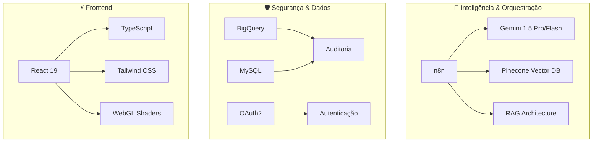

# 🤖 Ecossistema de Automação e Orquestração
### Phillipe (Nero) | Desenvolvedor de Automações & Vibe Coding

---

## 🎯 Visão Profissional

Sou focado em **Engenharia de Eficiência**. Meu trabalho envolve a intersecção de **Orquestração de Processos**, **Inteligência Artificial (RAG)** e **Segurança**. Transformo fluxos de trabalho manuais e repetitivos em ecossistemas digitais elegantes e escaláveis.

> **"Meu código não apenas executa; ele gera impacto operacional real."**

---

## 🧠 O Que é Este Portfólio? (Explicação Feynman)

> 💡 **Técnica Feynman**: Se você não consegue explicar algo de forma simples, você não entende bem o suficiente.

### Imagine Que...

Você tem uma **fábrica** com centenas de funcionários fazendo tarefas repetitivas:
- Um confere emails manualmente
- Outro copia dados de uma planilha para outra
- Outro manda lembretes por WhatsApp
- Outro organiza arquivos em pastas

**Eu construo robôs digitais** que fazem essas tarefas 24/7, sem erro, em segundos.

### 🏭 Analogia da Fábrica de Automação

| Tarefa Manual | Minha Automação | Tempo Economizado |
|---------------|-----------------|-------------------|
| Responder perguntas de RH | 🤖 RAVENA (IA com conhecimento) | 65% menos tickets |
| Aprovar orçamentos | 🛡️ Painel de Aprovações | 7 dias → 48 horas |
| Organizar fotos de propaganda | 📋 Central de Checking | 20 min → 2 segundos |
| Fazer backup de sistemas | 💾 DR Engine | Manual → Automático 3h AM |
| Avisar equipe de incidentes | 🔔 Jira Bridge | 30 min → 2 minutos |

---

## 🚀 Impacto Arquitetural

| Transformação | Antes | Depois | Ganho Operacional |
| :--- | :--- | :--- | :--- |
| **Resposta a Incidentes** | 30-60 min | **< 2 min** | **93% de aumento em eficiência** |
| **Aprovações de RH** | 7 Dias | **< 48 Horas** | **60% mais rápido** |
| **Validação de Mídia** | 20 min | **2.5 Segundos** | **99% de melhoria em velocidade** |
| **Recuperação de Desastres** | Risco Manual | **Automatizado** | **RTO < 5 minutos** |

---

## 📂 Projetos em Destaque

### 🤖 [RAVENA - Inteligência de RH com IA](./ravena-chatbot-rh/)
Chatbot de RH que utiliza **RAG (Geração Aumentada por Recuperação)** com **Google Gemini** e **Pinecone**.

| Aspecto | Detalhe |
|---------|---------|
| **Analogia** | 📚 Bibliotecária que leu todos os manuais |
| **Tech** | n8n, Gemini 1.5, Pinecone, Google Sheets |
| **Valor** | Reduz 65% dos tickets de RH |

---

### 🛡️ [Approval Panel - Gestão de Aprovações](./approval-panel/)
Dashboard em **React 19** para auditoria e governança orçamentária multiusuário.

| Aspecto | Detalhe |
|---------|---------|
| **Analogia** | 🎫 Crachá de visitante com níveis de acesso |
| **Tech** | React 19, TypeScript, BigQuery, RBAC |
| **Valor** | 100% de auditoria em decisões corporativas |

---

### 📋 [Central de Checking - Portal de Validação de Mídia](./cheking%20central/opus_checking_system/)
Portal para rastreamento de veiculação de mídia externa (OOH) e digital.

| Aspecto | Detalhe |
|---------|---------|
| **Analogia** | 🎪 Circo itinerante provando banners em 50 cidades |
| **Tech** | Vanilla JS, n8n, MySQL, Google Drive API |
| **Valor** | Organização automática de milhares de arquivos |

---

### 💾 [DR Engine - Infraestrutura de Backup Automatizado](./n8n-backup/)
Rotina de backup resiliente para instâncias n8n.

| Aspecto | Detalhe |
|---------|---------|
| **Analogia** | 🏠 Casa de LEGO com foto de cada etapa |
| **Tech** | n8n API, Google Drive, JavaScript |
| **Valor** | Recuperação em 5 minutos após desastre |

---

### 🔔 [Jira Bridge - Alertas de SOC em Tempo Real](./jira-discord-notifications/)
Integração entre criação de incidentes e intervenção da equipe técnica.

| Aspecto | Detalhe |
|---------|---------|
| **Analogia** | 🚒 Alarme de bombeiro que toca em todos os quartéis |
| **Tech** | Jira REST API, Discord Webhooks, n8n |
| **Valor** | Resposta de 30 min → 2 min |

---

### ✅ [Controle de Solicitações RH](./controle-solicitacoes-rh/)
Sistema de aprovação hierárquica para pedidos internos (férias, equipamentos, promoções).

| Aspecto | Detalhe |
|---------|---------|
| **Analogia** | 🍔 Restaurante com pedidos fluindo da cozinha ao cliente |
| **Tech** | n8n, SMTP, Google Sheets, Webhooks |
| **Valor** | Aprovações 60% mais rápidas |

---

## 🛠️ Ecossistema Tecnológico

### 🤖 Inteligência & Orquestração
- **Automação**: `n8n` (Lógica avançada, processamento de loops, tratamento de erros)
- **IA/LLM**: `Gemini 1.5 Pro/Flash`, `RAG Architectures`
- **Bancos Vetoriais**: `Pinecone`

### 🛡️ Segurança & Confiabilidade
- **Metodologia**: `Secure-by-Design`, conformidade com diretrizes de proteção de dados
- **Infraestrutura**: `Docker`, `OCI (Oracle Cloud)`
- **Auditoria**: `BigQuery`, `MySQL`

### ⚡ Excelência em Frontend
- **Core**: `React 19`, `TypeScript`
- **Estilização**: `Tailwind CSS`, `PostCSS`
- **Efeitos Visuais**: `Three.js`, `WebGL Shaders`

---

## 📚 Documentação Técnica

Cada projeto inclui documentação detalhada usando a **Técnica Feynman**:

| Seção | Descrição |
|-------|-----------|
| **"Imagine Que..."** | Analogias do mundo real |
| **Tabelas Comparativas** | Antes/depois, com/sem o sistema |
| **Diagramas ASCII** | Fluxos visuais sem dependências |
| **Glossário Técnico** | Termos explicados para não-técnicos |

---

## 🤝 Vamos Conversar?

Busco problemas complexos e soluções de alto impacto. Se você procura alguém que entende que **Dados são a moeda da confiança** e **Automação é o motor da escala**, vamos nos conectar.

  
  

---

  <i>Documentação usando Técnica Feynman — Explicando o complexo de forma simples</i>

