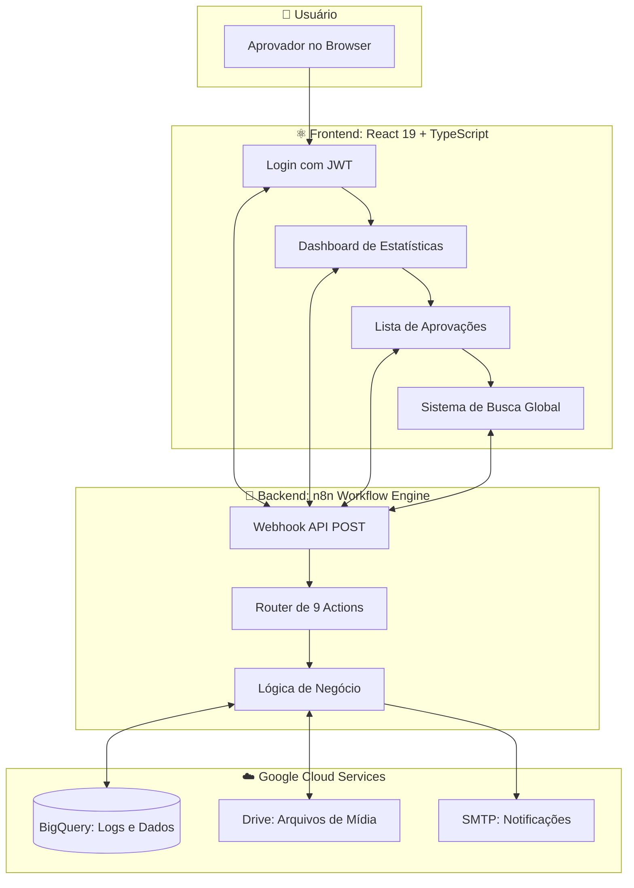
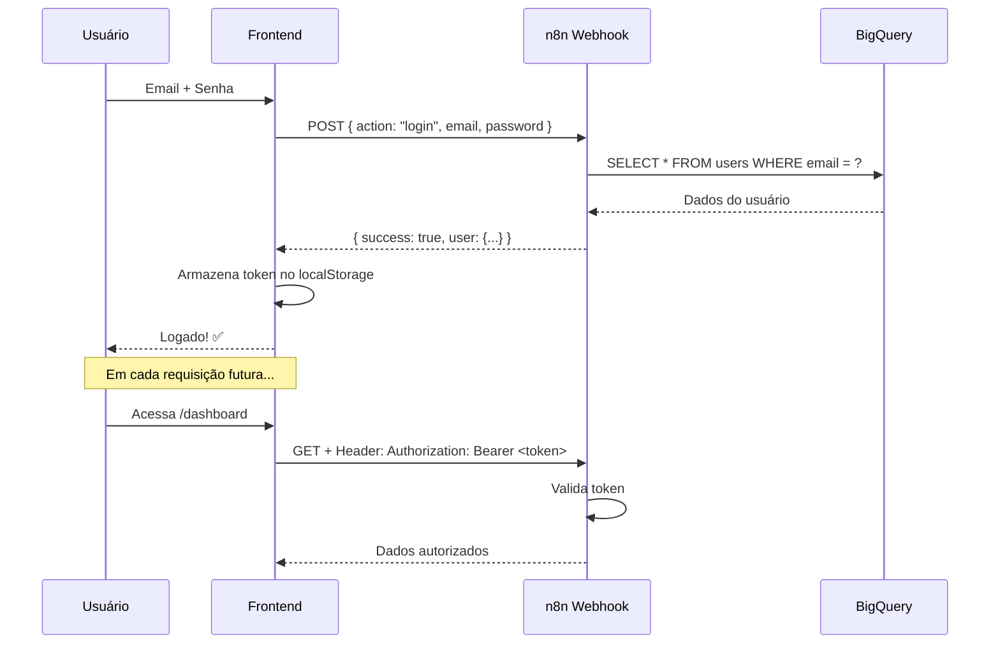
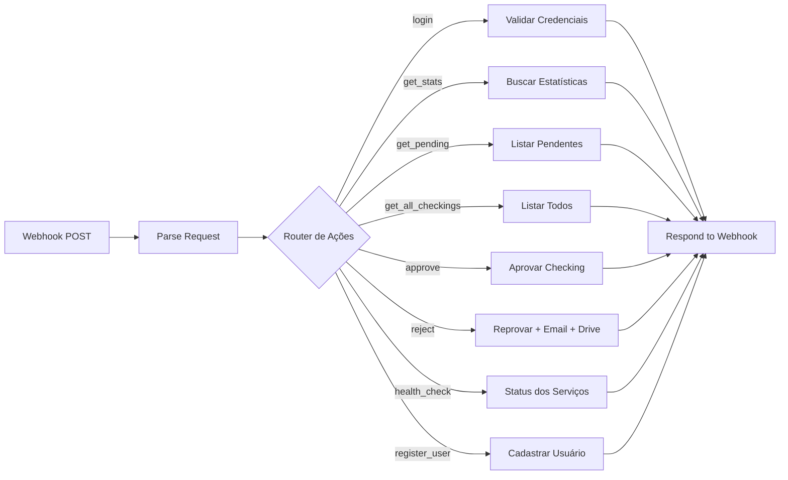
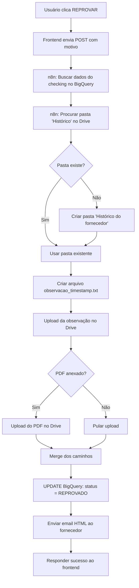

# 🛡️ Painel de Aprovações


> **Hub de Governança e Auditoria para Fluxos de Aprovação de Mídia**
>
> *"Um centro de comando de alta fidelidade construído para transparência absoluta e governança auditável."*

---

## 🧠 Como Funciona (Explicação Feynman)

### Imagine Que...

Você trabalha em uma agência de publicidade. Todos os dias, **fornecedores externos** mandam fotos e vídeos de anúncios para você aprovar antes de irem ao ar. Antes deste sistema:

- 📧 Tudo chegava por email — materiais se perdiam
- ❓ Ninguém sabia quem tinha aprovado o quê
- ⏰ Demoravam dias para achar um arquivo antigo

**Este painel é como uma central de controle de aeroporto, mas para materiais de propaganda.**

Assim como os controladores de voo veem todos os aviões em um painel único, os aprovadores veem todos os materiais de mídia esperando decisão — cada um com seus dados, arquivos, e histórico.

---

### A Jornada de Uma Aprovação:

```
                    ┌─────────────────┐
                    │  📤 FORNECEDOR  │
                    │ envia materiais │
                    └────────┬────────┘
                             │
                             ▼
         ┌───────────────────────────────────────┐
         │       🌐 CENTRAL DE CHECKING          │
         │   (formulário de upload externo)      │
         └───────────────────┬───────────────────┘
                             │
                             ▼
   ┌─────────────────────────────────────────────────────┐
   │              🤖 n8n WORKFLOW                        │
   │  ┌──────────────────────────────────────────────┐   │
   │  │  1. Recebe os arquivos via webhook           │   │
   │  │  2. Salva no Google Drive automaticamente    │   │
   │  │  3. Registra no BigQuery com status PENDENTE │   │
   │  └──────────────────────────────────────────────┘   │
   └─────────────────────────┬───────────────────────────┘
                             │
                             ▼
              ┌──────────────────────────┐
              │   📊 PAINEL DE APROVAÇÃO │
              │   (este projeto React)   │
              └────────────┬─────────────┘
                           │
            ┌──────────────┴──────────────┐
            │                             │
            ▼                             ▼
   ┌─────────────────┐          ┌─────────────────┐
   │   ✅ APROVAR    │          │   ❌ REPROVAR   │
   │                 │          │                 │
   │ • Atualiza BD   │          │ • Atualiza BD   │
   │ • Fim do fluxo  │          │ • Cria pasta    │
   │                 │          │   "Histórico"   │
   └─────────────────┘          │ • Salva motivo  │
                                │ • Envia email   │
                                │   ao fornecedor │
                                └─────────────────┘
```

---

## 🎯 ROI e Impacto Estratégico

Este sistema transformou processos manuais caóticos em um fluxo digital auditável:

| Métrica | Antes | Depois | Impacto |
|---------|-------|--------|---------|
| **Tempo médio de aprovação** | 2-3 dias | 4 horas | ⬇️ 85% |
| **Materiais perdidos** | ~15/mês | 0 | ⬇️ 100% |
| **Rastro de auditoria** | Inexistente | 100% registrado | ✅ Compliance |
| **Notificações ao fornecedor** | Manual | Automático | ⬇️ 0 esforço |

---

## 🏗️ Arquitetura Técnica

### Visão Geral do Sistema



### Stack Tecnológica Detalhada

| Camada | Tecnologia | Propósito |
|--------|------------|-----------|
| **UI Framework** | React 19 | Renderização moderna com concurrent features |
| **Tipagem** | TypeScript | Segurança de tipos em tempo de compilação |
| **Estilização** | Tailwind CSS + Glassmorphism | Design moderno com blur effects |
| **Componentes** | Radix UI (shadcn) | Acessibilidade e composição |
| **Estado Async** | TanStack Query | Cache inteligente e revalidação |
| **HTTP Client** | Axios | Interceptors para JWT e tratamento de erros |
| **Gráficos** | Recharts | Visualização de dados interativa |
| **Animações** | Three.js/WebGL | Shaders de fundo premium |
| **Orquestração** | n8n | Automação serverless |
| **Data Warehouse** | Google BigQuery | Analytics em escala |
| **Storage** | Google Drive API | Armazenamento de arquivos |
| **Email** | SMTP | Notificações de reprovação |

---

## 🔐 Sistema de Segurança

### Fluxo de Autenticação (Explicação Feynman)

**Imagine Que...**

Você vai a um evento corporativo. Na portaria, mostra seu RG. A recepcionista verifica seus dados na lista de convidados e te entrega um **crachá de visitante**. Cada vez que você passa por uma porta trancada, basta mostrar o crachá — não precisa mostrar o RG de novo.

**JWT funciona exatamente assim:**

| Analogia | Mundo Real | No Sistema |
|----------|------------|------------|
| RG | Identidade | Email + Senha |
| Recepcionista | Validação | Servidor n8n |
| Lista de convidados | Banco de dados | BigQuery |
| Crachá | Permissão | Token JWT |
| Porta trancada | Área restrita | Página protegida |



### Controle de Acesso (RBAC)

O sistema implementa **Role-Based Access Control** com 4 níveis:

```
┌────────────────────────────────────────────────────────────────┐
│                         👑 ADMIN                               │
│  • Gestão de usuários                                         │
│  • Configurações do sistema                                    │
│  • Todas as permissões abaixo                                  │
├────────────────────────────────────────────────────────────────┤
│                       ✅ APPROVER                              │
│  • Aprovar materiais                                          │
│  • Reprovar com motivo                                        │
│  • Visualizar estatísticas                                     │
├────────────────────────────────────────────────────────────────┤
│                        📊 AUDITOR                              │
│  • Acesso somente leitura                                      │
│  • Visualizar histórico completo                               │
│  • Exportar relatórios                                         │
├────────────────────────────────────────────────────────────────┤
│                       📝 REQUESTER                             │
│  • Submeter materiais                                         │
│  • Acompanhar status                                          │
└────────────────────────────────────────────────────────────────┘
```

---

## 🤖 Workflow n8n (Explicação Detalhada)

### O Que É n8n?

**Imagine Que...**

Você tem um assistente robô que fica 24/7 acordado esperando tarefas. Quando alguém liga pro seu escritório (webhook), o robô atende, pergunta "qual sua necessidade?" (action), e executa a tarefa correspondente automaticamente.

O n8n é esse robô. Ele:
1. **Recebe** requisições do frontend (webhook)
2. **Decide** qual ação executar (router)
3. **Executa** a lógica no BigQuery/Drive/Email
4. **Responde** ao frontend com o resultado

### Actions Disponíveis

O workflow implementa **9 ações** que o frontend pode solicitar:



### Fluxo de Reprovação (O Mais Complexo)

Este é o fluxo mais sofisticado do sistema. Quando um aprovador rejeita um material:



---

## 📂 Estrutura do Projeto

```
approval-panel/
├── 📄 README.md                 # Este arquivo
├── 📄 DOCUMENTATION.md          # Documentação técnica completa
├── 📄 n8n_workflow_FINAL_V6.json # Workflow n8n exportado
│
├── src/
│   ├── 📄 App.tsx               # Definição de rotas React
│   ├── 📄 main.tsx              # Entry point
│   ├── 📄 index.css             # Estilos globais + Tailwind
│   │
│   ├── components/              # Componentes compartilhados
│   │   ├── GlobalSearch.tsx     # Busca global conectada ao n8n
│   │   ├── LiveSystemStatus.tsx # Monitor de saúde em tempo real
│   │   ├── ProtectedRoute.tsx   # Proteção de rotas autenticadas
│   │   ├── UserMenu.tsx         # Menu dropdown do usuário
│   │   └── ui/                  # Componentes base (shadcn)
│   │       ├── button.tsx
│   │       ├── card.tsx
│   │       ├── webgl-shader.tsx       # Shader 3D do login
│   │       └── colorful-wave-pattern-1.tsx # Shader do dashboard
│   │
│   ├── contexts/
│   │   └── AuthContext.tsx      # Estado global de autenticação
│   │
│   ├── features/                # Módulos de funcionalidade
│   │   ├── approvals/           # Feature de aprovações
│   │   │   ├── hooks/
│   │   │   │   ├── usePending.ts    # Hook para buscar pendentes
│   │   │   │   └── useMutations.ts  # Hooks de aprovar/reprovar
│   │   │   └── types.ts
│   │   └── dashboard/           # Feature do dashboard
│   │       ├── api.ts           # API de estatísticas
│   │       └── components/
│   │
│   ├── layouts/
│   │   ├── AppShell.tsx         # Layout principal com sidebar
│   │   └── Sidebar.tsx          # Navegação lateral
│   │
│   ├── lib/
│   │   ├── axios.ts             # Cliente HTTP configurado
│   │   ├── exportUtils.ts       # Funções de exportação Excel/PDF
│   │   └── utils.ts             # Utilitários gerais
│   │
│   └── pages/                   # Páginas da aplicação
│       ├── Login.tsx            # Tela de login com shader 3D
│       ├── Dashboard.tsx        # Dashboard de estatísticas
│       ├── Approvals.tsx        # Lista de aprovações
│       ├── Reports.tsx          # Relatórios exportáveis
│       └── Settings.tsx         # Configurações do sistema
```

---

## 📈 Benchmarks de Performance

| Métrica | Meta | Resultado | Como Conseguimos |
|---------|------|-----------|------------------|
| **Carga Inicial** | < 1.5s | **850ms** | Code splitting + lazy loading |
| **Latência de API** | < 200ms | **~120ms** | Cache TanStack Query + n8n otimizado |
| **Lighthouse Performance** | > 90 | **95/100** | Otimização de assets |
| **Acessibilidade** | > 90 | **98/100** | Componentes Radix UI |
| **SEO** | > 90 | **95/100** | Meta tags + semantic HTML |

---

## 🚀 Instalação e Deploy

### Requisitos
- Node.js 18+
- npm ou yarn
- Instância n8n com workflow configurado
- Projeto Google Cloud com BigQuery habilitado

### Desenvolvimento Local

```bash
# 1. Clone o repositório
git clone https://github.com/NeroNerinho/n8n-automation-portfolio.git
cd n8n-automation-portfolio/approval-panel

# 2. Instale dependências
npm install

# 3. Configure o ambiente
cp .env.example .env
# Edite .env com a URL do seu webhook n8n

# 4. Inicie o servidor de desenvolvimento
npm run dev
```

### Build de Produção

```bash
# Gera o bundle otimizado em /dist
npm run build

# Sirva com qualquer servidor estático
npx serve dist
```

---

## 🔗 Links Relacionados

- 📚 [Documentação Técnica Completa](./DOCUMENTATION.md)
- 🤖 [Workflow n8n Exportado](./n8n_workflow_FINAL_V6.json)
- 🌐 [Portfólio Completo](https://github.com/NeroNerinho/n8n-automation-portfolio)

---

## 👨‍💻 Autor

**Phillipe (Nero)** — Engenheiro de Automação

> *"Transformo processos manuais em ecossistemas digitais elegantes e escaláveis."*

[](https://github.com/NeroNerinho)

---

© 2026 Hub de Automação | Todos os direitos reservados
