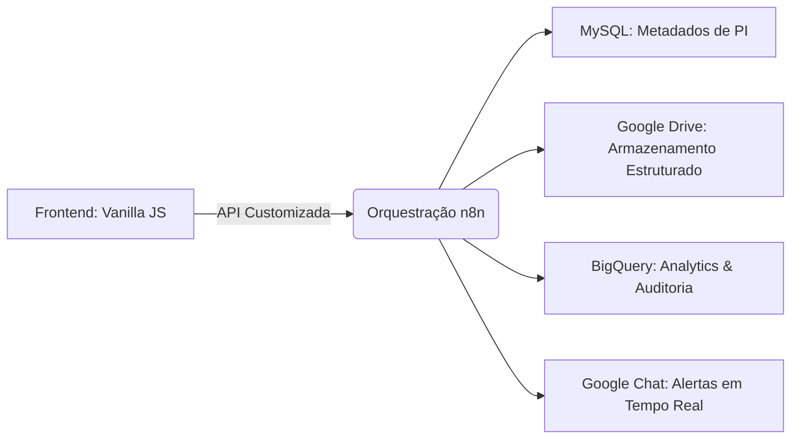

# Central de Checking - Validação de Mídia


## Visão Geral

A **Central de Checking** resolve o caos logístico de receber milhares de fotos de campanhas publicitárias (Out-of-Home). É um portal onde exibidores enviam comprovantes de veiculação, e o sistema organiza tudo automaticamente.

---

## Como Funciona (Analogia Simples)

### Imagine um Arquivista Automático

Antes, uma pessoa precisava:
1.  Receber 500 fotos no WhatsApp.
2.  Abrir uma por uma.
3.  Descobrir de qual cidade e campanha era.
4.  Renomear o arquivo ("foto_sp_campanha_x.jpg").
5.  Salvar na pasta correta no Google Drive.

**O Sistema faz isso em 2 segundos:**
1.  O exibidor entra no site e diz "Sou de SP, Campanha X".
2.  Ele solta as fotos.
3.  O "robô" pega cada foto, renomeia com o padrão correto e guarda na pasta certa na nuvem.
4.  Se a foto estiver corrompida, ele avisa na hora.

---

## Detalhes Técnicos

A solução elimina a necessidade de triagem humana para arquivos.

1.  **Ingestão**: Interface Web simples para upload.
2.  **Processamento (n8n)**:
    - Recebe os arquivos.
    - Aplica regras de taxonomia (Nome do Cliente + Data + Local).
    - Cria a estrutura de pastas no Google Drive (Ano > Mês > Campanha) se não existir.
3.  **Resultado**: Organização perfeita e imediata.

### Ganhos

- **Tempo**: De dias para segundos.
- **Erro Humano**: Reduzido a zero (não há chance de salvar na pasta errada).

**Antes deste sistema:**
| Problema | Como era |
|----------|----------|
| 📧 Provas vinham por email | Se perdiam em caixas de entrada |
| 📁 Organização manual | Horas renomeando e movendo arquivos |
| ❓ Sem rastreamento | "O outdoor da Av. Paulista foi veiculado?" |

**Com o Sistema de Checking:**
| Solução | Como é agora |
|---------|-------------|
| 🌐 Portal único | Fornecedor acessa e envia diretamente |
| 🤖 Organização automática | Sistema cria pastas e nomeia arquivos |
| 📊 Rastreamento total | Dashboard mostra status em tempo real |

### 🎪 Analogia do Circo

Imagine um **circo itinerante** que viaja por 50 cidades. O dono precisa provar para os patrocinadores que os banners deles apareceram em cada cidade.

- **Sem sistema**: Malabarista guarda fotos no celular, palhaço perde o pendrive, mágico esquece de tirar foto
- **Com sistema**: Cada artista acessa o portal, seleciona a cidade, e envia as provas organizadamente

### 📍 O Desafio Especial: Mídia OOH (Outdoor/Frontlight)

Uma campanha pode ter **100+ endereços** diferentes. O sistema:
1. **Busca os endereços** automaticamente do banco de dados
2. **Gera um card** para cada endereço no formulário
3. **Exige 2 fotos por endereço**: uma de perto e uma de longe
4. **Cria subpastas** organizadas no Google Drive

```
📁 PI-12345-CocaCola/
├── 📁 Av. Paulista, 1000/
│   ├── perto.jpg
│   └── longe.jpg
├── 📁 Rua Augusta, 500/
│   ├── perto.jpg
│   └── longe.jpg
└── 📁 ...mais 98 endereços/
```

---

##  Arquitetura de Alto Nível

Desenvolvido com uma filosofia **"Vanilla-First"** para máxima confiabilidade e performance sem latência.



### 🛠️ Stack Tecnológica:
- **Frontend**: JavaScript Vanilla leve (ES6+), CSS3 com propriedades customizadas e HTML5 semântico.
- **Orquestração**: `n8n` gerenciando lógicas complexas de roteamento para diversos meios de mídia.
- **Camada de Dados**: 
    - `MySQL`: Para consultas em tempo real de PIs (Pedidos de Inserção).
    - `BigQuery`: Agregação de logs em larga escala para analytics.
- **Estratégia de Armazenamento**: Gerenciamento programático via Google Drive API com criação dinâmica de pastas.

---

## 🚀 Recursos Técnicos Avançados

### 📍 Roteamento Dinâmico OOH (Outdoor/Frontlight)
O sistema possui um módulo especializado para mídia **Extra (OOH)**. Quando uma PI de OOH é detectada:
1. **Busca de Dados Dinâmica**: O sistema recupera os endereços exatos do banco de dados do ERP.
2. **Geração de UI**: Cria automaticamente cards de upload individuais para *cada* endereço.
3. **Protocolo de Prova Dupla**: Exige fotos de "Perto" e de "Longe" para conformidade total.
4. **Ingestão Aninhada**: O n8n cria subpastas dedicadas para cada endereço dentro do diretório principal da PI.

### 🧩 Lógica Consciente de Mídia
A interface se adapta a mais de **15 tipos de mídia** (TV, Rádio, Cinema, Digital, etc.), garantindo que metadados específicos como "Inserções Totais" ou "Marcação de Veículo" sejam capturados apenas quando relevantes.

### 🛡️ Resiliência e Segurança
- **Sanitização de Dados**: Filtros embutidos para limpar entradas de usuários e prevenir ataques de injeção.
- **Motor de Progresso de Upload**: Implementação XHR customizada fornecendo feedback em tempo real para o usuário.
- **Persistência de Estado**: Gerencia envios em múltiplas etapas (Original vs. Complemento) com rastreamento automático de status.

---

## 📈 Benchmarks de Performance

| Componente | Métrica | Desempenho |
| :--- | :--- | :--- |
| **Latência de Busca** | Consulta de PI | < 300ms |
| **Velocidade de Envio** | Upload Multi-arquivo | ~50MB/s (Dependente da Rede) |
| **Peso do Frontend** | Payload Total | < 100KB (Gzip) |

---

## 🔧 Configuração Interna

1. **Endpoint de API**: Atualize o `API_ENDPOINT` no arquivo `script.js` para apontar para o seu webhook do n8n.
2. **Configuração de Meios**: Estenda o objeto `MEDIA_TYPE_CONFIG` em `script.js` para adicionar novas regras de validação.
3. **Lógica de Backend**: Importe o arquivo JSON do n8n para estabelecer as conexões com MySQL, Drive e BigQuery.

---

### 👨‍💻 Desenvolvido por Phillipe (Nero)
> *Desenvolvedor dedicado à automação de fluxos de negócios e eficiência operacional.*
