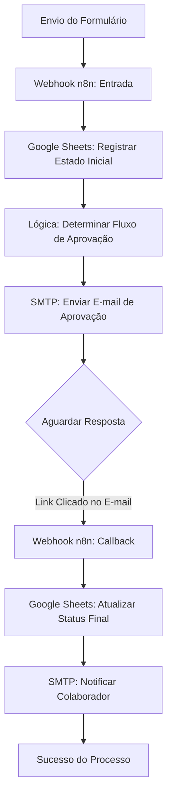

# ✅ Controle de Solicitações: Orquestração de Processos de RH


> **"Transformando solicitações caóticas via e-mail em um motor de aprovação organizado e de alta visibilidade."**

---

## 🎯 Resumo Executivo (SLA e Excelência Operacional)

O **Controle de Solicitações de RH** é uma automação corporativa que gerencia o ciclo de vida completo de pedidos internos (Férias, Benefícios, Alterações de Cargo). Ao implementar uma arquitetura de **callback assíncrono**, o sistema elimina o "buraco negro" dos e-mails e garante que cada pedido seja rastreado, roteado e resolvido.

### 🚀 Impacto Estratégico no Negócio:
- **Aprovações 60% mais Rápidas**: O ciclo médio de aprovação caiu de **7 dias** para menos de **48 horas**.
- **100% de Rastreabilidade**: Cada decisão (Aprovação/Rejeição) é registrada com timestamp e identificação do aprovador.
- **Redução de 75% na Carga do RH**: Elimina a necessidade de follow-ups manuais e entrada repetitiva de dados.
- **Experiência do Colaborador**: Notificações em tempo real mantêm os funcionários informados em cada etapa do processo.

---

## 🧠 Como Funciona (Explicação Feynman)

> 💡 **Técnica Feynman**: Se você não consegue explicar algo de forma simples, você não entende bem o suficiente.

### Imagine Que...

Você está num **restaurante movimentado**. Quando um cliente faz um pedido:

1. 📝 **Garçom anota** o pedido
2. 🍳 **Cozinha prepara** (com tempo de espera)
3. ✅ **Gerente confere** se está correto
4. 🍽️ **Cliente recebe** o prato

**Este sistema faz o mesmo** — mas para pedidos de RH!

### 🍔 Analogia do Restaurante

| Restaurante | Sistema de RH |
|-------------|---------------|
| Cliente faz pedido | Funcionário pede férias |
| Comanda vai pra cozinha | Formulário vai pro gestor |
| Cozinheiro prepara | Gestor analisa |
| Gerente aprova | RH valida |
| Prato entregue | Férias confirmadas |

### 📧 O Problema do "Buraco Negro" de Emails

**Antes do sistema:**
```
Funcionário: "Pedi férias há 2 semanas, cadê?"
Gestor: "Não vi o email..."
RH: "O gestor não me mandou..."
Funcionário: 😤
```

**Com o sistema:**
```
Funcionário: Abre o painel → vê "Aguardando Gestor"
Gestor: Recebe email com botões → clica "Aprovar"
RH: Recebe automaticamente → clica "Confirmar"
Funcionário: Recebe email → "Férias aprovadas! 🎉"
```

### 🔗 O Que é "Callback Assíncrono"?

Imagine pedir um Uber. Você não fica parado esperando — o app te avisa quando o motorista chegar.

```
┌─────────────────────────────────────────────────────────────┐
│ 1️⃣ FUNCIONÁRIO ENVIA PEDIDO                                │
│    → Sistema registra e para de "pensar"                    │
└─────────────────────────────────────────────────────────────┘
                          │
                          ▼
┌─────────────────────────────────────────────────────────────┐
│ 2️⃣ EMAIL ENVIADO AO GESTOR                                 │
│    📧 "Você tem 1 pedido para aprovar"                      │
│    [✅ APROVAR]  [❌ REJEITAR]  ← Links únicos              │
└─────────────────────────────────────────────────────────────┘
                          │
            (horas ou dias depois...)
                          │
                          ▼
┌─────────────────────────────────────────────────────────────┐
│ 3️⃣ GESTOR CLICA NO LINK                                    │
│    → Link "acorda" o sistema (callback)                     │
│    → Sistema continua de onde parou                         │
└─────────────────────────────────────────────────────────────┘
                          │
                          ▼
┌─────────────────────────────────────────────────────────────┐
│ 4️⃣ FUNCIONÁRIO NOTIFICADO                                  │
│    📧 "Suas férias foram aprovadas!"                        │
└─────────────────────────────────────────────────────────────┘
```

### 🏢 Níveis de Aprovação

Dependendo do tipo de pedido, mais pessoas precisam aprovar:

| Tipo de Pedido | Quem Aprova |
|----------------|-------------|
| **Férias** | Gestor direto (1 nível) |
| **Equipamento** | Gestor → Financeiro (2 níveis) |
| **Promoção** | Gestor → RH → Diretoria (3 níveis) |

---

##  Arquitetura Técnica

Um workflow orientado a eventos que utiliza lógica de "Aguardar Webhook" para lidar com decisões humanas no processo.



### 🛠️ Stack Tecnológica:
- **Motor**: `n8n` (Lógica condicional de múltiplas etapas).
- **Comunicação**: `SMTP` (Templates HTML responsivos) + `Webhooks` (Endpoints de retorno).
- **Camada de Auditoria**: `Google Sheets API` para dashboards em tempo real.
- **Lógica de Roteamento**: Mapeamento hierárquico baseado no tipo de solicitação (ex: Promoções exigem múltiplas aprovações).

---

## 🧠 Detalhes de Engenharia

### 📬 Hub de Callback Assíncrono
O sistema não fica consultando por respostas. Ele gera **links de callback únicos e assinados** embutidos no e-mail do gestor. Ao clicar, esses links ativam o ramo específico no workflow n8n, "acordando" o processo para seguir para a próxima etapa.

### 🗺️ Roteamento Hierárquico Dinâmico
O fluxo mapeia o caminho de aprovação de acordo com a categoria:
- **Férias**: Gestor Direto (1 nível).
- **Equipamentos/Treinamento**: Gestor Direto → Financeiro (2 níveis).
- **Promoções**: Gestor → RH → Diretoria (3 níveis).

### 🎨 Templates com Lógica Embutida
Os templates de e-mail são injetados com dados dinâmicos da solicitação, incluindo justificativas e prazos, garantindo que os aprovadores tenham todo o contexto necessário para decidir sem precisar abrir outros sistemas.

---

## 📈 Benchmarks de Impacto

| Métrica | Processo Manual | Com Automação |
| :--- | :--- | :--- |
| **Tempo de Resolução** | 3 - 7 Dias | **1 - 2 Dias** |
| **Pedidos Perdidos/Esquecidos** | ~8% | **0% (Finalização Forçada)** |
| **Entrada Manual de Dados** | 20 min / pedido | **Zero (Automatizado)** |
| **Visibilidade do Status** | Baixa | **Alta (Painel Online)** |

---

## 🔧 Configuração e Integração

1. **Importação**: Importe o arquivo `Controle de Solicitações - RH.json` no n8n.
2. **Banco de Dados**: Vincule a planilha do Google Sheets onde as colunas correspondam ao esquema definido no workflow.
3. **Callbacks**: Atualize os links `href` nos nós de e-mail para apontarem para o seu endereço de webhook de produção.
4. **Gatilhos**: Conecte seus formulários internos (Google Forms, Typeform ou Portais Customizados) ao webhook de entrada.

---

### 👨‍💻 Desenvolvido por Phillipe (Nero)
> *Desenvolvedor focado em otimização de processos de negócio e fluxos inteligentes.*
