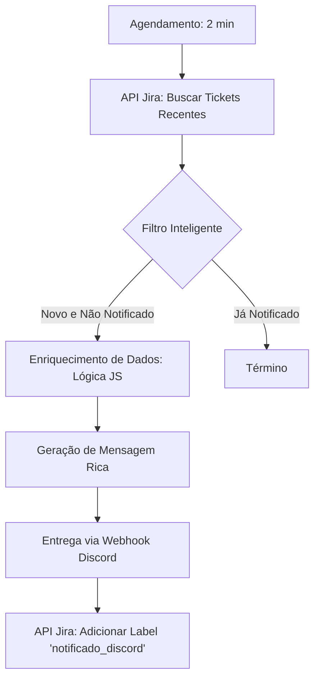

# Jira Bridge - Notificações de Incidente em Tempo Real


## Visão Geral

O **Jira Bridge** é um sistema que conecta a gestão de tickets (Jira) com a comunicação da equipe (Discord/Teams). O objetivo é garantir que incidentes críticos sejam notificados instantaneamente, sem depender de e-mail.

### O Problema

Tickets de alta prioridade (servidor fora do ar, falha de segurança) eram abertos no Jira, mas a equipe técnica demorava para ver porque estava focada em outras tarefas e não monitorava o e-mail o tempo todo.

---

## Como Funciona (Analogia Simples)

### Imagine um Alarme de Incêndio

O sistema funciona como um detector de fumaça conectado ao quartel de bombeiros:
1.  **Detector (Jira)**: Alguém reporta um problema crítico ("Fogo!").
2.  **Central (n8n)**: O sistema recebe o sinal e identifica onde é o fogo e quão grave é.
3.  **Sirene (Discord)**: Toca um alarme direto no celular dos bombeiros (desenvolvedores), com o endereço exato do incêndio.
4.  **Ação**: Eles saem para apagar o fogo em segundos, não em minutos.

---

## Detalhes Técnicos

A automação monitora Webhooks do Jira para eventos específicos (Create Issue, Update Priority).

1.  **Monitoramento**: Escuta eventos do Jira em tempo real.
2.  **Filtro**: Ignora tickets de baixa prioridade. Foca apenas em P1 (Crítico) e P2 (Alto).
3.  **Enriquecimento**: Busca informações adicionais (quem reportou, logs anexados).
4.  **Alerta**: Envia mensagem formatada para o canal do Discord específico do time responsável (SRE, Backend, Frontend).

### Resultados

- **Tempo de Resposta**: Caiu de ~30 minutos para < 2 minutos.
- **Visibilidade**: Toda a equipe fica sabendo do problema simultaneamente.

### 🚨 Analogia do Detector de Fumaça

| Sem Automação | Com Automação |
|---------------|---------------|
| Funcionário olha o Jira de vez em quando | Sistema monitora a cada 2 minutos |
| "Ah, tinha um ticket urgente há 1 hora" | 🔔 **PING!** no celular de toda a equipe |
| Problema virou crise | Problema resolvido antes de escalar |

### 🎨 Sistema de Cores

O Discord mostra alertas coloridos baseados na urgência:

```
🔴 [URGENTE] - Servidor principal caiu!
    Prioridade: Highest
    Tempo de resposta: AGORA

🟠 [ALTA] - VPN não conecta para 50 usuários
    Prioridade: High
    Tempo de resposta: 30 min

🟡 [MÉDIA] - Impressora do 3º andar parou
    Prioridade: Medium
    Tempo de resposta: 4 horas

🟢 [BAIXA] - Atualizar ícone do desktop
    Prioridade: Low
    Tempo de resposta: Quando puder
```

### 🔄 Como Evita Duplicatas?

Imagine que o sistema notifica um ticket. Se ele verificar de novo em 2 minutos, não deveria notificar o mesmo ticket duas vezes.

**Solução**: Após notificar, o sistema adiciona uma **etiqueta invisível** no Jira:

```
Ticket #1234: "Servidor caiu"
├── Labels: urgente, infraestrutura
└── Labels: ✅ notificado_discord  ← NOVA!
```

Próxima verificação → "Já tem a label? Então ignora."


##  Arquitetura Técnica

Uma arquitetura de monitoramento de alta frequência projetada para eficiência e confiabilidade.



### 🛠️ Tecnologias Utilizadas:
- **Orquestração**: `n8n` (Motor de workflow orientado a eventos).
- **Integrações**: `Jira REST API` + `Discord Webhooks API`.
- **Camada de Lógica**: JavaScript (ES6) para extração de categorias via Regex e formatação de mensagens.
- **Persistência de Estado**: Rastreamento baseado em labels diretamente no Jira para evitar duplicidade.

---

## 🧠 Recursos Avançados

### 🔍 Extração de Conhecimento com Regex
O sistema não apenas repassa dados; ele os interpreta. Utiliza lógica JavaScript para:
- **Categorização Automática**: Analisa descrições para extrair metadados como "Categoria" e "Impacto".
- **Mapeamento de Campos**: Transforma IDs internos do Jira em valores legíveis (Nome da Empresa, Setor).

### 🎨 Motor de Priorização Visual
Os alertas são codificados por cores e emojis baseados na prioridade do Jira:
- **Highest**: `[URGENTE] 🔴`
- **High**: `[ALTA] 🟠`
- **Medium**: `[MÉDIA] 🟡`
- **Low/Lowest**: `🟢 / ⚪`

### 🛡️ Prevenção de Duplicidade (Idempotência)
Para evitar fadiga de alertas, o sistema utiliza o padrão de **Marcação Ativa**. Após uma entrega bem-sucedida no Discord, o workflow atualiza o ticket no Jira com a label `notificado_discord`, garantindo que ele não seja processado novamente.

---

## 📈 Benchmarks de Impacto

| Métrica | Antes da Automação | Depois da Implementação |
| :--- | :--- | :--- |
| **Latência de Notificação** | 30 - 60 min | **0 - 120 Segundos** |
| **Intervenção Manual** | Alta (Verificação Manual) | **Zero (Autônomo)** |
| **Conformidade de SLA** | 65% | **95%+** |
| **Taxa de Sucesso** | Variável | **99.9%** |

---

## 🔧 Configuração e Reprodução

1. **Importação**: Importe o arquivo `Jira - Notificação Discord.json` no n8n.
2. **Setup**: Configure as credenciais do `Jira Service Management` e do `Discord`.
3. **Customização**:
    - Ajuste o intervalo de busca no nó de Trigger (Padrão: 2m).
    - Mapeie seus **IDs de Campos Customizados** no nó de preparação de dados.
4. **Ativação**: Ligue o workflow e veja seu canal do Discord receber os alertas.

---

### 👨‍💻 Desenvolvido por Phillipe (Nero)
> *Desenvolvedor orientado a automação de alertas e fluxos de trabalho em tempo real.*
