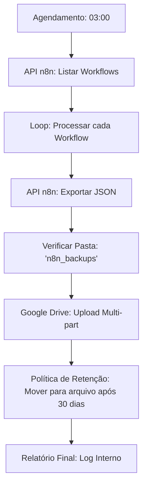

# DR Engine - Backup e Recuperação de Desastres


## Visão Geral

O **DR Engine (Disaster Recovery)** é a "apólice de seguro" do ecossistema de automação. Ele realiza backups automáticos de todos os fluxos de trabalho (workflows) e configurações do n8n, garantindo que o sistema possa ser restaurado rapidamente em caso de falha.

### O Risco

Automações complexas levam meses para serem construídas. Perder esse trabalho por uma falha de servidor ou erro humano ("deletei sem querer") é inaceitável. O DR Engine resolve isso.

---

## Como Funciona (Analogia Simples)

### Imagine uma Fotocopiadora Automática

Imagine que você está escrevendo um livro importante.
1.  Todo dia, às 3 da manhã (quando você dorme), um robô entra no seu escritório.
2.  Ele tira uma cópia de tudo o que você escreveu até aquele momento.
3.  Ele guarda essa cópia em um cofre à prova de fogo em outro prédio (Google Drive).
4.  Se no dia seguinte seu computador queimar, você vai até o cofre e pega a cópia da noite anterior. Você perdeu no máximo algumas horas de trabalho, nunca o livro todo.

---

## Detalhes Técnicos

A solução utiliza a API administrativa do n8n para exportar os dados em formato JSON.

1.  **Agendamento**: Executa via Cron Job diariamente.
2.  **Extração**: Conecta na API do n8n e baixa todos os workflows.
3.  **Versionamento**: Salva o arquivo com data/hora (ex: `backup_2023-10-27.json`).
4.  **Armazenamento**: Envia para pasta segura no Google Drive ou repositório Git.

### Métricas de Recuperação (RTO)

- **Sem Backup**: Dias ou semanas para reconstruir tudo do zero.
- **Com Backup**: < 5 Minutos para importar o arquivo JSON e restaurar o sistema.

```
┌────────────────────────────────────────────────────────────┐
│ ⏰ TODO DIA ÀS 03:00 DA MANHÃ                              │
└────────────────────────────────────────────────────────────┘
                           ▼
┌────────────────────────────────────────────────────────────┐
│ 1️⃣ LISTA: "Quais workflows existem no n8n?"               │
│    → API retorna: Workflow A, B, C, D, E...                │
└────────────────────────────────────────────────────────────┘
                           │
                           ▼
┌────────────────────────────────────────────────────────────┐
│ 2️⃣ EXPORTA: Para cada workflow                            │
│    → Baixa o JSON completo com todas as configurações      │
└────────────────────────────────────────────────────────────┘
                           │
                           ▼
┌────────────────────────────────────────────────────────────┐
│ 3️⃣ ORGANIZA: Cria pasta com data                          │
│    📁 backup_2026-02-07/                                   │
│    ├── WorkflowA.json                                      │
│    ├── WorkflowB.json                                      │
│    └── WorkflowC.json                                      │
└────────────────────────────────────────────────────────────┘
                           │
                           ▼
┌────────────────────────────────────────────────────────────┐
│ 4️⃣ UPLOAD: Envia pro Google Drive                         │
│    → Fica seguro na nuvem, redundante                      │
└────────────────────────────────────────────────────────────┘
                           │
                           ▼
┌────────────────────────────────────────────────────────────┐
│ 5️⃣ LIMPA: Remove backups com mais de 30 dias              │
│    → Mantém o Drive organizado                             │
└────────────────────────────────────────────────────────────┘
```

### 🔥 Cenário de Desastre

**Servidor caiu. Tudo perdeu. E agora?**

| Passo | Ação | Tempo |
|-------|------|-------|
| 1 | Acessa Google Drive | 1 min |
| 2 | Baixa pasta do último backup | 1 min |
| 3 | Importa workflows no novo n8n | 3 min |
| **Total** | **Tudo de volta** | **5 min** |


---

##  Arquitetura do Sistema

Um fluxo robusto que interage com a API REST do n8n e a API do Google Drive.



### 🛠️ Stack Tecnológica:
- **Motor**: `n8n` (Orquestração de nós).
- **Armazenamento**: `Google Drive` (Redundante na nuvem).
- **Integração de APIs**: `n8n API` (Introspecção de workflows) + `Google Drive API v3`.
- **Lógica de Versionamento**: Hierarquia de pastas com data/hora via JavaScript.

---

## 🧠 Recursos Técnicos

### 📂 Versionamento Inteligente
O sistema cria uma estrutura organizada e datada:
- `backup_AAAA-MM-DD/`
    - `NomeDoWorkflow-Ativo.json`
    - `NomeDoWorkflow-Inativo.json`

### 🛡️ Lógica de Retenção e Rotação
- **Retenção Ativa**: Mantém os últimos 30 backups diários na pasta principal.
- **Arquivamento**: Migra backups antigos para uma pasta dedicada, garantindo a organização do armazenamento.

### ✅ Validação de Integridade
- **Verificação Pré-Upload**: Cada JSON exportado é validado antes de ser enviado para a nuvem.
- **Operações Atômicas**: Garante que a falha na exportação de um fluxo não interrompa o backup dos outros.

---

## 📈 Benchmarks de Performance

| Métrica | Antes | Depois |
| :--- | :--- | :--- |
| **Frequência de Backup** | Manual/Irregular | **Diário (Automático)** |
| **Tempo de Recuperação** | Indeterminado | **< 5 Minutos** |
| **Confiabilidade** | ~70% | **99.9% (Estabilidade OAuth2)** |
| **Gestão de Espaço** | Arquivos Estáticos | **Eficiente (Rotativo)** |

---

## 🔧 Implantação e Reprodução

1. **Importação**: Importe o arquivo `N8N - Backup WorkFlow.json` no seu n8n.
2. **Setup**: Configure as credenciais de `Google Drive OAuth2` e `n8n API`.
3. **Caminhos**: Atualize os IDs das pastas do Google Drive nos nós de verificação de pasta.
4. **Gatilho**: Ative o nó de agendamento (Cron) para execução automática.

---

### 👨‍💻 Desenvolvido por Phillipe (Nero)
> *Desenvolvedor focado em resiliência de infraestrutura e automação DevOps.*
