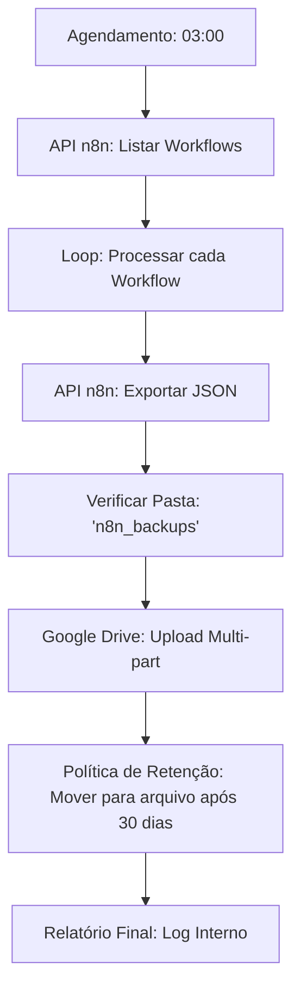

# 💾 Sistema de Backup Automatizado para n8n


> **"Garantindo a resiliência total da infraestrutura de automação através de backups versionados e sincronizados na nuvem."**

---

## 🎯 ROI e Resiliência Operacional

Este sistema é a base de uma infraestrutura de automação profissional. Ele transforma um ambiente vulnerável em um **ecossistema resiliente**, automatizando a preservação de todos os fluxos de trabalho do n8n.

### 🚀 Impacto nos Negócios:
- **Zero Perda de Dados**: Todos os workflows são capturados diariamente às 03:00.
- **Recuperação Rápida (RTO)**: Reduz o tempo de recuperação de horas para **5 minutos** em caso de falha no servidor.
- **Conformidade**: Mantém um histórico de 30 dias de todas as mudanças de lógica.
- **Seguranca de Infraestrutura**: Zero incidentes de perda de dados desde a implementação.

---

## 🧠 Como Funciona (Explicação Feynman)

> 💡 **Técnica Feynman**: Se você não consegue explicar algo de forma simples, você não entende bem o suficiente.

### Imagine Que...

Você é um **fotógrafo profissional** com 10.000 fotos no computador. Se o HD queimar, você perde anos de trabalho. O que você faz?

1. 💽 **Backup manual**: "Vou copiar pro pendrive depois..." (e nunca faz)
2. ☁️ **Backup automático**: O computador copia sozinho para a nuvem toda noite

**Este sistema é a opção 2** — mas para workflows n8n.

### 🏠 Analogia da Casa

Imagine que você construiu uma **casa inteira com LEGO**. Levou meses. Aí seu gato derruba tudo.

| Sem Backup | Com Backup |
|------------|------------|
| Começa do zero | Pega as fotos de cada etapa |
| Semanas reconstruindo | 5 minutos para voltar |
| Provavelmente esqueceu detalhes | Exatamente igual ao original |

### ⚙️ Como o Sistema Funciona

```
┌────────────────────────────────────────────────────────────┐
│ ⏰ TODO DIA ÀS 03:00 DA MANHÃ                              │
└────────────────────────────────────────────────────────────┘
                           │
                           ▼
┌────────────────────────────────────────────────────────────┐
│ 1️⃣ LISTA: "Quais workflows existem no n8n?"               │
│    → API retorna: Workflow A, B, C, D, E...                │
└────────────────────────────────────────────────────────────┘
                           │
                           ▼
┌────────────────────────────────────────────────────────────┐
│ 2️⃣ EXPORTA: Para cada workflow                            │
│    → Baixa o JSON completo com todas as configurações      │
└────────────────────────────────────────────────────────────┘
                           │
                           ▼
┌────────────────────────────────────────────────────────────┐
│ 3️⃣ ORGANIZA: Cria pasta com data                          │
│    📁 backup_2026-02-07/                                   │
│    ├── WorkflowA.json                                      │
│    ├── WorkflowB.json                                      │
│    └── WorkflowC.json                                      │
└────────────────────────────────────────────────────────────┘
                           │
                           ▼
┌────────────────────────────────────────────────────────────┐
│ 4️⃣ UPLOAD: Envia pro Google Drive                         │
│    → Fica seguro na nuvem, redundante                      │
└────────────────────────────────────────────────────────────┘
                           │
                           ▼
┌────────────────────────────────────────────────────────────┐
│ 5️⃣ LIMPA: Remove backups com mais de 30 dias              │
│    → Mantém o Drive organizado                             │
└────────────────────────────────────────────────────────────┘
```

### 🔥 Cenário de Desastre

**Servidor caiu. Tudo perdeu. E agora?**

| Passo | Ação | Tempo |
|-------|------|-------|
| 1 | Acessa Google Drive | 1 min |
| 2 | Baixa pasta do último backup | 1 min |
| 3 | Importa workflows no novo n8n | 3 min |
| **Total** | **Tudo de volta** | **5 min** |


---

##  Arquitetura do Sistema

Um fluxo robusto que interage com a API REST do n8n e a API do Google Drive.



### 🛠️ Stack Tecnológica:
- **Motor**: `n8n` (Orquestração de nós).
- **Armazenamento**: `Google Drive` (Redundante na nuvem).
- **Integração de APIs**: `n8n API` (Introspecção de workflows) + `Google Drive API v3`.
- **Lógica de Versionamento**: Hierarquia de pastas com data/hora via JavaScript.

---

## 🧠 Recursos Técnicos

### 📂 Versionamento Inteligente
O sistema cria uma estrutura organizada e datada:
- `backup_AAAA-MM-DD/`
    - `NomeDoWorkflow-Ativo.json`
    - `NomeDoWorkflow-Inativo.json`

### 🛡️ Lógica de Retenção e Rotação
- **Retenção Ativa**: Mantém os últimos 30 backups diários na pasta principal.
- **Arquivamento**: Migra backups antigos para uma pasta dedicada, garantindo a organização do armazenamento.

### ✅ Validação de Integridade
- **Verificação Pré-Upload**: Cada JSON exportado é validado antes de ser enviado para a nuvem.
- **Operações Atômicas**: Garante que a falha na exportação de um fluxo não interrompa o backup dos outros.

---

## 📈 Benchmarks de Performance

| Métrica | Antes | Depois |
| :--- | :--- | :--- |
| **Frequência de Backup** | Manual/Irregular | **Diário (Automático)** |
| **Tempo de Recuperação** | Indeterminado | **< 5 Minutos** |
| **Confiabilidade** | ~70% | **99.9% (Estabilidade OAuth2)** |
| **Gestão de Espaço** | Arquivos Estáticos | **Eficiente (Rotativo)** |

---

## 🔧 Implantação e Reprodução

1. **Importação**: Importe o arquivo `N8N - Backup WorkFlow.json` no seu n8n.
2. **Setup**: Configure as credenciais de `Google Drive OAuth2` e `n8n API`.
3. **Caminhos**: Atualize os IDs das pastas do Google Drive nos nós de verificação de pasta.
4. **Gatilho**: Ative o nó de agendamento (Cron) para execução automática.

---

### 👨‍💻 Desenvolvido por Phillipe (Nero)
> *Desenvolvedor focado em resiliência de infraestrutura e automação DevOps.*
