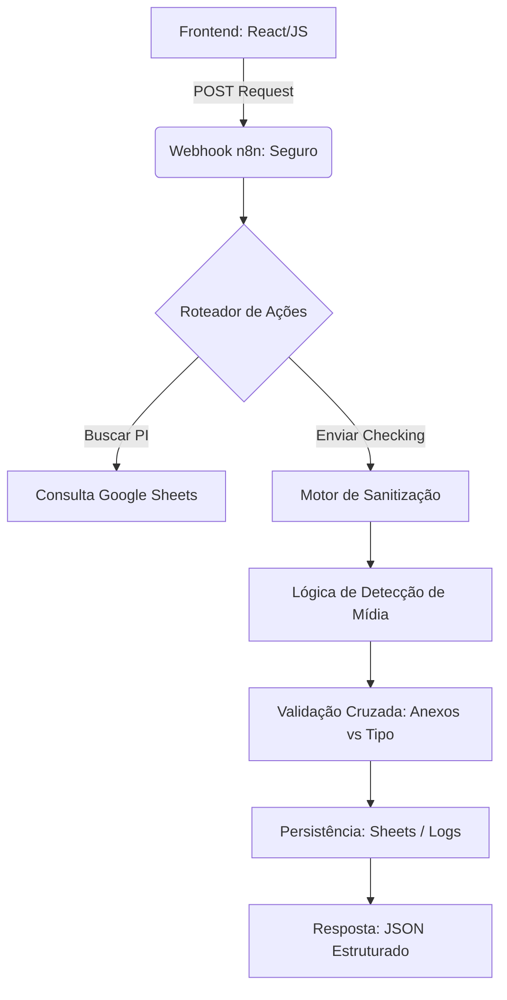

#  Validador de PIs: Gatekeeper de Integridade de Dados

> **"Transformando a validação manual de pedidos em um portal automatizado e seguro de 2 segundos."**

---

##  Resumo Executivo (Inteligência e Auditoria)

O **Validador de PIs** (Pedidos de Inserção) é um motor de validação avançado projetado para eliminar um dos maiores gargalos publicitários: **dados de pedidos incorretos e envios de arquivos inseguros**. Ele atua como uma camada de segurança entre as requisições do frontend e os bancos de dados finais (Google Sheets/BigQuery).

###  Resultados Estratégicos:
- **Redução de 80% nos Erros**: Filtros automatizados capturam falhas antes que os dados cheguem ao financeiro ou RH.
- **Validação 99% mais Rápida**: Reduziu o ciclo de verificação de **20 minutos** (manual) para **menos de 3 segundos**.
- **ROI Significativo**: Economiza aproximadamente **20 horas de trabalho qualificado por semana**.
- **Segurança Zero-Trust**: Sanitização rigorosa de dados previne ataques de injeção e XSS.

---

##  Arquitetura Técnica

Uma arquitetura resiliente que combina um frontend flexível com um núcleo de lógica complexo no n8n.

###  Stack Tecnológica:
- **Orquestrador Central**: `n8n` (Gerenciamento de ramificações lógicas).
- **Banco de Dados Leve**: `Google Sheets API` com indexação de alta velocidade.
- **Camada de Segurança**: Sanitizadores JavaScript customizados + Headers de resposta HTTP.
- **Integração de Frontend**: JavaScript/React com adaptação de interface em tempo real.

---

##  Recursos Avançados

###  Detecção Automática de Mídia
O sistema possui um algoritmo de sensing proprietário. Caso o tipo de mídia esteja faltando no ERP, o sistema analisa o nome do site/veículo usando regex para categorizar automaticamente:
- Termos como `outdoor`, `painel` → **Mídia Externa (OOH)**.
- Termos como `globo`, `televisão` → **TV**.

###  Programação Defensiva e Sanitização
Cada campo enviado passa por um filtro que remove caracteres perigosos (`< > " ' \``), impõe limites de tamanho e valida formatos (E-mails, IDs de PI), garantindo a integridade do banco de dados.

###  Lógica de Anexos Condicionais
O sistema impõe requisitos de arquivos diferentes baseados no meio detectado:
- **Digital**: Exige links ou arquivos de log.
- **Extra (OOH)**: Exige o padrão de foto "Perto + Longe".
- **TV**: Exige comprovante e roteiro em formatos específicos.

---

##  Benchmarks de Impacto

| Métrica | Antes da Automação | Situação Atual |
| :--- | :--- | :--- |
| **Taxa de Erro nos Envios** | 40% | **< 8%** |
| **Tempo Médio de Validação** | 15 - 20 min | **2.5 Segundos** |
| **Volume Processado (PIs/Dia)** | ~50 | **200+** |
| **Custo Operacional** | Alto (Auditores manuais) | **Mínimo (Automático)** |

---

##  Configurações Internas

1. **Integração de API**: Aponte seu frontend para o webhook de produção do n8n.
2. **Mapeamento de Planilhas**: Certifique-se de que os IDs das colunas na planilha coincidam com os nós de busca do workflow.
3. **Headers de Segurança**: O nó de resposta HTTP está pré-configurado com headers de proteção contra ataques comuns da web.

---

###  Desenvolvido por Phillipe (Nero)
> *Desenvolvedor focado em integridade de dados e automação inteligente.*
