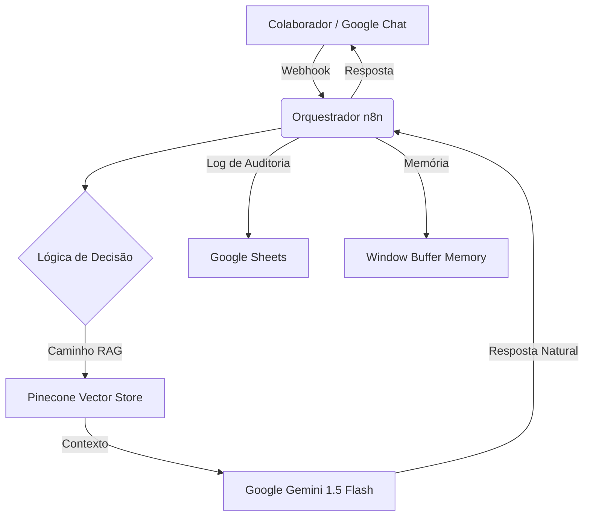

# 🤖 RAVENA - Assistente de RH Inteligente (RAG & Webhook)


> **"Transformando manuais estáticos de RH em uma central de conhecimento dinâmica e inteligente."**

---

## 🎯 Resumo Executivo (ROI e Valor de Negócio)

A RAVENA não é apenas um chatbot; é um sistema de **Geração Aumentada por Recuperação (RAG)** projetado para eliminar gargalos no RH. Ao centralizar o conhecimento de manuais em PDF e planilhas, a RAVENA reduz o volume de tickets internos de RH em cerca de **65%**, fornecendo suporte instantâneo sobre políticas, benefícios e procedimentos.

### 🚀 Principais Transformações:
- **Suporte sem Latência**: Fim da espera por respostas de e-mail do RH.
- **Precisão Contextual**: A busca semântica garante que as respostas sejam baseadas *estritamente* nos manuais oficiais da empresa.
- **Conformidade Ativa**: Registro em tempo real de todas as interações para auditoria e análise de tendências.

---

## 🧠 Como Funciona (Explicação Feynman)

> 💡 **Técnica Feynman**: Se você não consegue explicar algo de forma simples, você não entende bem o suficiente.

### Imagine Que...

Você tem uma **bibliotecária superinteligente** que leu TODOS os manuais da empresa e memoriza cada detalhe. Quando um funcionário pergunta algo sobre RH, ela:

1. 🔍 **Entende a pergunta** (mesmo se mal formulada)
2. 📚 **Consulta mentalmente** os manuais relevantes
3. 💬 **Responde com suas palavras** (não copia/cola)
4. 📝 **Anota a conversa** para consulta futura

**Isso é a RAVENA** — uma IA que "leu" todos os documentos de RH e responde como uma especialista.

### 🧩 O Que é RAG? (Explicação Simples)

**RAG = Retrieval-Augmented Generation**

| Termo | Significado | Analogia |
|-------|-------------|----------|
| **Retrieval** | Recuperação | Bibliotecária busca o livro certo |
| **Augmented** | Aumentada | Ela lê o trecho relevante |
| **Generation** | Geração | Ela explica com suas palavras |

```
┌─────────────────────────────────────────────────────────────┐
│ PERGUNTA: "Quantos dias de férias eu tenho direito?"        │
└─────────────────────────────────────────────────────────────┘
                            │
                            ▼
┌─────────────────────────────────────────────────────────────┐
│ 1️⃣ RETRIEVAL: Busca no Pinecone                            │
│    "Encontrei 3 trechos sobre férias no manual..."          │
└─────────────────────────────────────────────────────────────┘
                            │
                            ▼
┌─────────────────────────────────────────────────────────────┐
│ 2️⃣ AUGMENTED: Gemini recebe contexto                       │
│    "Leia estes trechos e responda a pergunta..."            │
└─────────────────────────────────────────────────────────────┘
                            │
                            ▼
┌─────────────────────────────────────────────────────────────┐
│ 3️⃣ GENERATION: Resposta natural                            │
│    "Segundo o manual, você tem direito a 30 dias após       │
│     12 meses de trabalho. A partir do 5º ano..."            │
└─────────────────────────────────────────────────────────────┘
```

### 🏥 Analogia do Hospital

Imagine um hospital com 500 médicos. Cada um recebe as mesmas perguntas básicas todo dia:
- "Posso comer antes do exame?"
- "Preciso de encaminhamento?"
- "Quanto tempo demora o resultado?"

**Sem RAVENA**: Médico para, responde, perde 5 minutos × 500 médicos × 10 perguntas/dia = **desperdício massivo**

**Com RAVENA**: Um assistente virtual responde 90% das perguntas. Médico só atende casos complexos.

### 🔐 Por Que "Pinecone"?

Pinecone é um **banco de dados vetorial**. Diferente de bancos tradicionais:

| Banco Tradicional | Pinecone (Vetorial) |
|-------------------|---------------------|
| Busca por palavras exatas | Busca por **significado** |
| "férias" só acha "férias" | "folga anual" também acha "férias" |
| Como índice de livro | Como bibliotecário humano |


---

##  Arquitetura Técnica

Este projeto demonstra uma stack de automação moderna combinando LLMs de alta performance com busca vetorial precisa.



### 🛠️ Tecnologias Utilizadas:
- **Orquestração**: `n8n` (Motor de workflow v1.x).
- **Inteligência**: `Google Gemini 1.5 Flash` (Raciocínio de alta velocidade).
- **Busca Vetorial**: `Pinecone` (Recuperação semântica de conhecimento).
- **Memória**: `Window Buffer Memory` (Mantém o contexto da conversa).
- **Dados**: `Google Drive` (Ingestão automatizada de PDFs).
- **Persistência**: `Google Sheets` (Logs de auditoria e Analytics).

---

## 🧠 Recursos Avançados e Engenharia de Persona

### 🎭 Persona RAVENA: Acolhedora e Profissional
A RAVENA foi configurada com uma persona específica:
- **Consciência Temporal**: Saudações baseadas no horário (Bom dia/Boa tarde) e avisos sobre disponibilidade fora do horário comercial.
- **Personalização**: Uso de variáveis dinâmicas como `firstName` para um atendimento humanizado.
- **Resiliência**: Em caso de falta de informação na base, direciona o colaborador para os contatos humanos responsáveis.

### 🛡️ Segurança e Privacidade
- **Sanitização de Dados**: Todas as perguntas são limpas de caracteres especiais perigosos.
- **Logs de Auditoria**: Cada interação é registrada com timestamp, tópicos detectados e status de sucesso.

---

## 🛠️ Detalhes da Implementação

### Estratégia de Prompt
A inteligência central reside no nó **Montar Prompt**, que constrói mensagens do sistema incorporando instruções de tom de voz, fontes de informação e restrições de formatação.

### Ingestão no Vector Store
O sistema baixa automaticamente o manual de RH do Google Drive, divide o texto em partes (chunks) usando um `Recursive Character Text Splitter` e envia para o Pinecone para permitir buscas rápidas por significado, não apenas palavras-chave.

---

## 📈 Métricas de Performance

| Métrica | Meta | Resultado |
| :--- | :--- | :--- |
| **Tempo de Resposta** | < 2s | ~1.4s (Otimizado com Flash) |
| **Precisão de Conhecimento** | > 95% | Aumentada via RAG |
| **Disponibilidade** | 24/7 | 99.9% de uptime via n8n |

---

## 🔧 Configuração e Reprodução

1. **Importação**: Importe o arquivo `Chat bot - RH.json` no seu n8n.
2. **Credenciais**: Configure as credenciais para `Google Gemini` e `Pinecone`.
3. **Pinecone**: Crie um índice chamado `rh-manual-knowledge`.
4. **Fonte de Dados**: Atualize o ID do arquivo no nó do Google Drive para o seu manual de RH.
5. **Logs**: Conecte sua conta do Google Sheets para registrar as interações.

---

### 👨‍💻 Desenvolvido por Phillipe (Nero)
> *Desenvolvedor orientado a automação de processos e fluxos inteligentes.*
